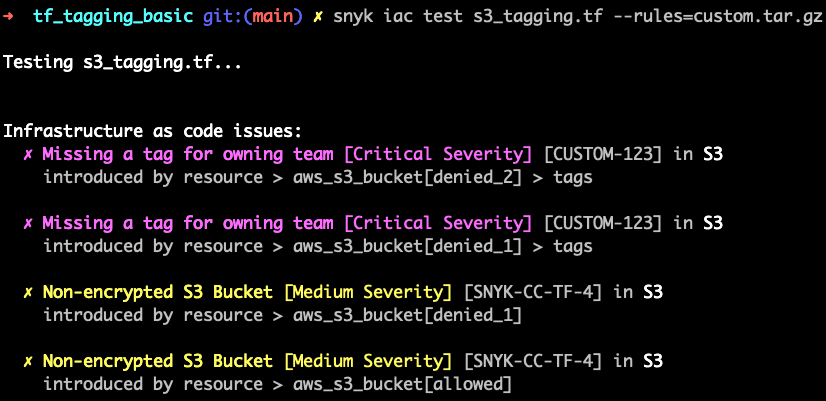

# Test Driven Terraform Resource Tagging

## Overview

This rule deonstrates a test driven workflow for parsing a Terraform file and checking for the presence of a defined tag.

[Open Policy Agent](https://www.openpolicyagent.org/docs/latest/policy-testing/) includes a unit testing framework out of the box.

It's recommended to use a test driven workflow so that you can ensure the rule you're writing, behaves as you expect locally before you roll it out to your development teams.

## Rule Requirements

- Each AWS S3 Bucket must be tagged with the owning `Team`

## Testing

We can use the built in unit testing functionality from OPA in order to assert the desired behaviour.

There are two parts to this

1. Fixtures - we need example files that contain the invalid terraform
2. Test - we'll write a seperate rego files that asserts the expected response.

### Example Failing Terraform

This terraform file shows the correct behaviour with `denied_1` and `denied_2` from `s3_tagging_failing.tf`

```hcl
# We expect all resources to adhere to our tagging standard of providing a
# `Team` for the owning team name

# This fails as no tags are provided
resource "aws_s3_bucket" "denied_1" {
  bucket = "my-tutorial-bucket"
  acl    = "private"
}

# This fails as only Cost_Centre is provided, Team is missing.
resource "aws_s3_bucket" "denied_2" {
  bucket = "my-tutorial-bucket"
  acl    = "private"

  tags = {
    owning_team = "abc-123"
  }
}
```

### Rego test

In `custom_test.rego` you'll need to include the parsed JSON version of `s3_tagging_failing.tf`
You can generate this using `conftest parse s3_tagging_failing.tf` and it is stored in a variable called `invalid :=`
Note: you do not need to wrap the json object in a string.

The test takes this variable as a mocked input and asserts that we expect a `deny` response

```rego
package main

# generated using `conftest parse s3_tagging_failing.tf`
invalid := {"resource": {"aws_s3_bucket": {"denied_1": {"acl": "private", "bucket": "my-tutorial-bucket"}, "denied_2": {"acl": "private", "bucket": "my-tutorial-bucket", "tags": {"owning_team": "abc-123"}}}}}

test_incorrect_tags {
	deny with input as invalid
}
```

You can run `opa test . -v` to see the passing tests.

## Rule

from `custom.rego`

```rego
deny[msg] {
	resource := input.resource.aws_s3_bucket[name]
	not resource.tags.Team
```

`resource := input.resource.aws_s3_bucket[name]` is referencing all of the s3 resources
`not resource.tags.Team` will return true if the `Team` property is **not** defined.

The final rego is as follows

```rego
deny[msg] {
	resource := input.resource.aws_s3_bucket[name]
	not resource.tags.Team

	msg := {
		"id": "124",
		"publicId": "CUSTOM-123",
		"title": "Missing a tag for owning team",
		"type": "custom",
		"subType": "S3",
		"severity": "critical",
		"policyEngineType": "opa",
		"issue": "There is no defined tag for the owning team",
		"impact": "Deployment will be blocked until this is resolved.",
		"resolve": "Set `aws_s3_bucket.tags.Team`",
		"msg": sprintf("input.resource.aws_s3_bucket[%s].tags", [name]),
		"references": [],
	}
}
```

## Result

Running this on the example file and you'll get this output


