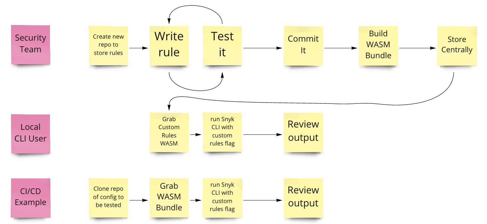

# Snyk Infrastructure as Code - Custom Rules

## Table of contents

1. [Background](##Background)
1. [Overview](##Feature-Overview)
1. [Workflow](##Workflow)
1. [Getting Started](##Getting-Started)
1. [Pre-Requisites](###pre-requisites)
1. [Exploring Rego](###Exploring-rego)
1. [Support](#Support)
1. [Additional Resources](#Additional-resources)

**Writing & Using Custom Rules**

1. [Writing a rule](writing.md)
1. [Distribution](distribution.md)
1. [Execution](execution.md)
1. [Worked Examples](examples/readme.md)

# Snyk Infrastructure as Code - Custom Rules

## Background

The Snyk Infrastructure as Code product can scan configuration files for any security misconfigurations, via the CLI or by importing a repository from GitHub.

Today we support scanning Kubernetes, Helm, Terraform & CloudFormation configuration files.

Snyk aims to provide a comprehensive set of security rules out of the box, across all of the core infrastructure providers (Kubernetes, AWS, Azure, GCP) that cover key benchmarks such as CIS as well as recommended best practices from Cloud Providers.

Whilst we aim to provide all of the rules you need out of the box, we recognise that there may be scenarios where you need to add additional rules yourself which are specific to your business or application needs.

We’re providing the ability for you to write your own custom rules and have those run alongside the Snyk provided rules.

This functionality is currently available in **invite-only beta**

This means that support is provided on a case-by-case basis and should be directed through your account team to Ben Laplanche the Product Manager for Snyk IaC.

## Feature Overview

Snyk Infrastructure as Code is based upon Open Policy Agent and uses a language called Rego. All of the Snyk provided rules are written in [Rego](https://www.openpolicyagent.org/docs/latest/#rego).

Any custom rules that you write will be written in [Rego](https://www.openpolicyagent.org/docs/latest/#rego) and can be written locally either in your IDE of choice or using the online [rego playground](https://play.openpolicyagent.org/)

Rules can be written for any configuration format that Snyk IaC supports, currently on the CLI this is

- Kubernetes
- Terraform
- CloudFormation

_Example use-cases for custom rules:_

- Enforcing tagging standards - e.g. all resources must have an owning team
- Deprecating a particular feature - e.g. a service or API endpoint
- Preventing use of particular services - e.g. developers cannot use AWS xyz
- Workload placement rules - e.g. resources tagged as sensitive must be placed in region us-east-1a

Ultimately any use-case that can be codified into rego is supported. The limits are what you can write in rego, not what this feature can run.

Today, custom rules will only be supported for execution via the Snyk IaC CLI. Support for running these against repositories imported from GitHub will be added in the future.

## Workflow

There are two key activities to writing custom rules:

1. Writing & Distribution - This will typically be the Security Team and we expect to be handled centrally. In this activity, the relevant business logic is identified and codified into a rule which is then compiled and distributed to be executed via the Snyk IaC CLI.

2. Execution - Using the Snyk IaC CLI the custom rules are then executed alongside the Snyk provided rules to provide a comoprehensive security view.

for example `$ snyk iac test my-kubernetes-deployment.yaml --rules=custom.tar.gz` targets a kubernetes deployment manifest and references a local artefact which contains your custom rules.

## Getting Started

Before you proceed to writing your first rule, we recommend you ensure you've met the pre-requisities outlined below and spent some time exploring the Rego language.

### Pre-requisites

- [Snyk CLI](https://support.snyk.io/hc/en-us/articles/360003812538-Install-the-Snyk-CLI) v1.618.0 or greater
- [Open Policy Agent CLI](https://www.openpolicyagent.org/docs/latest/#running-opa) (needed to compile the rules)
- [Conftest](https://www.conftest.dev/install/) (needed to parse the JSON when writing a rule)

In future releases we will provide a Docker image which Snyk will maintain that will contain these prerequisites, so they do not need to be downloaded or maintained by yourself.

### Exploring Rego

We recommend that if you are not familiar with Rego, you first read the documentation [here](https://www.openpolicyagent.org/docs/latest/#rego).
Once you have read this, then take a look at some of the basic tutorials on the [Rego Playground](https://play.openpolicyagent.org/)

You can use the drop down at the top of the rego playground to find worked examples, in particular look at:

- Kubernetes - Hello World
- Kubernetes - Label Existence

# Support

This feature is currently in beta - support is provided on a best case effort via the product team. Please raise any issues through your customer slack channel to Ben Laplanche the Snyk IaC Product Manager.

# Additional Resources

- [Open Policy Agent Slack](https://slack.openpolicyagent.org/) - There is an active slack community who are willing to help with Rego queries.
