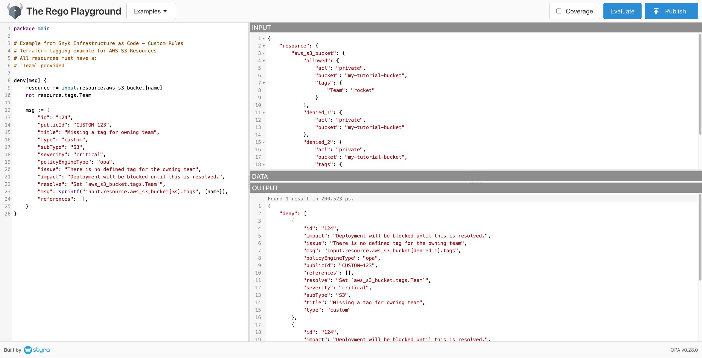
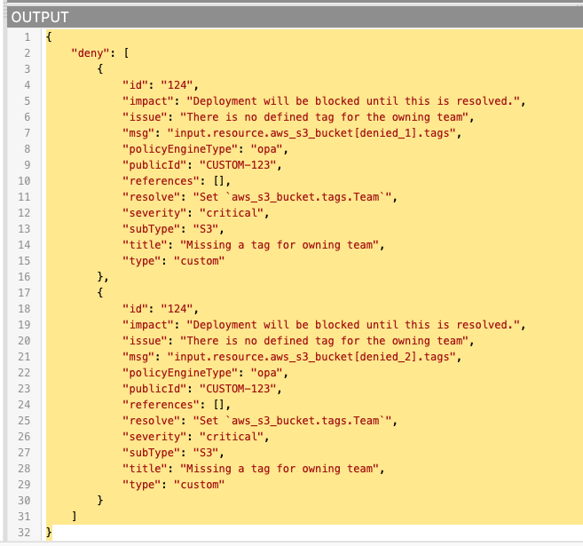

# Writing a custom rule

Lets walk through an end-to-end example of creating a rule.

This example can be found [here](examples/tf_tagging_basic/readme.md)

1. [Identify your rule](##Identify-your-rule)
1. [Create an example config file](##Create-an-example-config-file)
1. [Parse into JSON](##Parse-into-json)
1. [Write the rego logic](##Write-the-rego-logic)
1. [Test](##Test)
1. [Build](##Build)

## Identify your rule

For this rule, we'd like to ensure that all of our Terraform AWS S3 Buckets follow our companies naming standard.

We expect each AWS S3 Bucket to be tagged with:

- `Team` - name of the owning team

---

## Create an example config file

In order to write the correct rego logic, we need a reference Terraform file which correctly adheres to these standards.

We recommend you also provide one or two examples of failing configurations in order to validate your rule logic.

You can name the resources such as `allowed` or `denied_1` / `denied_2` to help identify the different test cases.

```hcl
# We expect all resources to adhere to our tagging standard of providing a
# `Team` for the owning team name

# This is an example of a resource that correctly adheres to the standard
resource "aws_s3_bucket" "allowed" {
  bucket = "my-tutorial-bucket"
  acl    = "private"

  tags = {
    Team = "rocket"
  }
}

# This fails as no tags are provided
resource "aws_s3_bucket" "denied_1" {
  bucket = "my-tutorial-bucket"
  acl    = "private"
}

# This fails as only Cost_Centre is provided, Team is missing.
resource "aws_s3_bucket" "denied_2" {
  bucket = "my-tutorial-bucket"
  acl    = "private"

  tags = {
    owning_team = "abc-123"
  }
}
```

---

## Parse into JSON

Open Policy Agent does not understand Terraform (hcl) or Kubernetes / CloudFormation (yaml) files directly. When you execute the Snyk IaC CLI on a configuration file it is first parsed into a standard JSON format which the rules are evaluated against.

When we are writing the rules, we need to parse the example configuration file into JSON ourselves. This only needs to be done during development.

**Note:** In future releases this step will be provided via the Snyk Docker image.

Navigate to `examples/tf_tagging_basic` and execute
`$ conftest parse s3_tagging.tf`

This will return the following JSON to your CLI terminal.

```json
{
  "resource": {
    "aws_s3_bucket": {
      "allowed": {
        "acl": "private",
        "bucket": "my-tutorial-bucket",
        "tags": {
          "Team": "rocket"
        }
      },
      "denied_1": {
        "acl": "private",
        "bucket": "my-tutorial-bucket"
      },
      "denied_2": {
        "acl": "private",
        "bucket": "my-tutorial-bucket",
        "tags": {
          "owning_team": "abc-123"
        }
      }
    }
  }
}
```

---

## Write the rego logic

For this we will use the Rego Playground.
You can find the [completed example here](https://play.openpolicyagent.org/p/AjqFXwLO1O)


Alternatively, you can start from fresh [rego](https://play.openpolicyagent.org/) and deleting the contents of the left hand panel & the input panel (top right).

---

### Input panel

To evaluate a rule and make a decision, an input must be provided.
This is the JSON representation of the configuration file.

Paste in the JSON output from the previous step into the top right hand panel.

You'll see in the rego logic this is referenced as `input.`

---

### Rego logic

Start by creating a package called `main` by adding `package main` as your opening statement.

This creates a namespace called `main` which we'll reference when we compile the rules. We recommend sticking to this naming convention to start with.

Next create a new rule called `deny[msg] {}`
`deny` is a convention in Rego for rules that are expected to pass and `msg` is the name of the response that will be returned. `deny` expects a response of `true` in order to succeed.

So far your rule will look as follows:

```rego
deny[msg] {
}
```

**Identify resources**

Next we want to add the logic to test for the presence of the `Team` tag.
Using the `input.` method provided by the rego language we can traverse the JSON object we created to check for the presence of this tag.

As follows `resource := input.resource.aws_s3_bucket[name]`

Breaking this down we get
`resource :=` creates a new variable called `resource`

`input.resource.aws_s3_bucket` references the resource we are interested in

`[name]` assigns a variable called Name and allows us to enumerate across all of the s3 bucket resources.

**Check for presence of tags**

Now we've accessed all of the S3 buckets in our configuration files and assigned them to a variable called `resource` we can test for the presence of the `Team` tag as follows

`not resource.tags.Team`
Breaking this down we get
`not ` inverts the response - turning a false into true
`resource.tags.Team` returns the value if found and False if its not present.

So in our `allowed` example, the tag is found meaning it returns `true` and `not` inverts this to `false`, which does _not_ trigger the deny message.

In our `denied_1` example, the tag is **not** found meaning it returns `false` and `not` inverts this to `true`, which _does_ trigger the deny message.

Your rego logic should now look as follows

```rego
deny[msg] {
	resource := input.resource.aws_s3_bucket[name]
	not resource.tags.Team
}
```

**Define error message**
Lastly, we need to define the message that we'd like to be returned to the user.

This is handled by adding the `msg :=` property as follows

```rego
deny[msg] {
	resource := input.resource.aws_s3_bucket[name]
	not resource.tags.Team

	msg := {
		"id": "124",
		"publicId": "CUSTOM-123",
		"title": "Missing a tag for owning team",
		"type": "custom",
		"subType": "S3",
		"severity": "critical",
		"policyEngineType": "opa",
		"issue": "There is no defined tag for the owning team",
		"impact": "Deployment will be blocked until this is resolved.",
		"resolve": "Set `aws_s3_bucket.tags.Team`",
		"msg": sprintf("input.resource.aws_s3_bucket[%s].tags", [name]),
		"references": [],
	}
}
```

This format of the `msg` property must be followed in order to ensure the output correctly displays on the Snyk IaC CLI.

The attributes that you can change are as follows:

`id`
`publicID` choose a naming convention unique to yourselves such as `ACME-001`

`title` a short title that should summarise the issue

`subType` a sub-grouping that makes sense e.g. "tagging"

`severity` this can be one of `low/medium/high/critical`

`issue` a more detailed string explanation of what the exact issue is

`impact` a more detailed string explanation of what the impact of not resolving this issue is

`resolve` a more detailed string explanation of how to resolve the issue. We recommend providing a code snippet here

`msg` we recommend only changing the resource name and property e.g. `aws_s3_bucket[%s].tags` to match your example. The function `sprintf` is provided by rego and enables us to provide a dynamic error message explaining exactly where the issue was found.

`references` you can provide an array of strings with URLs to documentation

---

## Test

You can now execute your rule using the OPA Playground to see if it works as expected.

If successful you should see the following



Here you can see that two of the resources correctly failed the check.
So we know our rules is working!

---

## Build

Now we've validated that we have created a rule that does what we expect, the last step is to compile the rules.

**Note:** in future releases this step will be handled by the Snyk provided Docker image

`$ opa build -t wasm -e "main/deny" --output custom.tar.gz custom.rego`

If we break this down:
`opa build` is calling the build command on the open policy agent CLI

`-t wasm` is specifying the type to be compiled is as a Web Assembly Bundle (WASM)

`-e "main/deny"` is referencing the package name space of `main` and all rules called `deny`

`--output custom.tar.gz` is the file name of the final artefact

`custom.rego` is the filename that contains our logic. Currently we have one file to reference, this could also be a directory of files.

### Example

If successful, you should see the following output

```bash

```
